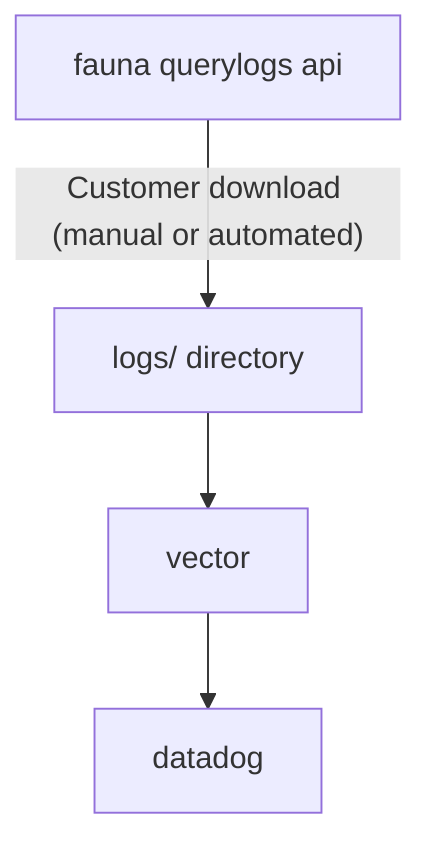
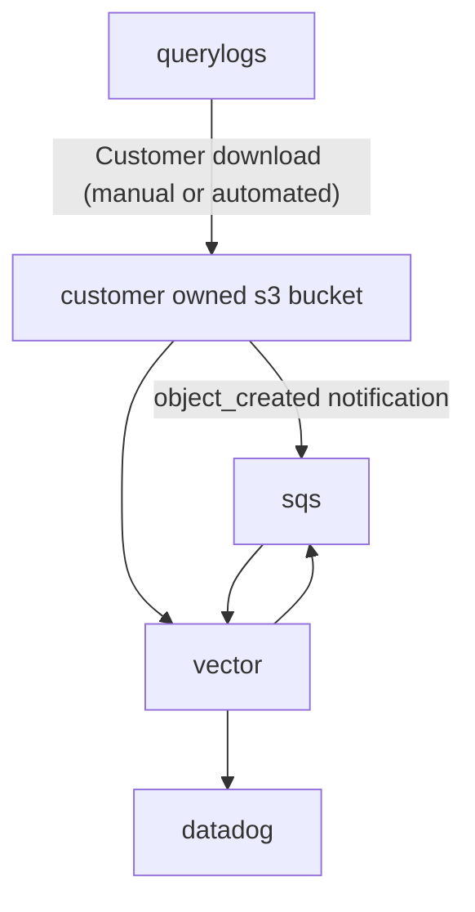

# basic demo: ship querylogs to datadog

## Usage

`DD_API_KEY=<datadog api key> ./run-vector-in-docker.sh logs/`

The command above will launch vector in a docker container and ship any querylogs found in the `logs/` directory to datadog metrics.

Your `DD_API_KEY` (datadog api key) must be supplied via an env variable.

**NOTE** - we've included some demo data in `logs/` so you can try publication without having to pull down any logs.

## Description

This repo contains very simple example code to ship metrics exported from fauna's querylogs api to datadog.

You can combine this example code with the `example-program.js` in the main querylogs-demo directory to automate query log ingestion into data dog metrics. This will enable you to create alarms on things like 5XX codes from Fauna or extreme levels of compute, read or write ops.

The process you could build is shown below:

1. Downloads logs from fauna and writes them into the `logs/` directory exactly as downloaded (this could be performed via a scheduled job running code like you see in `example-program.js`).
2. A utility called [vector](https://vector.dev) ingests the files from the `logs/` directory, transforms these logs into the format expected by datadog, and ships this data into datadog as tagged gauge metrics.

Vector will discover any new files added to the logs directory and ship all of their contents to datadog. Vector keeps track of the progress it has made as it goes by writing persistent state (to the `vector-state/` directory in this example) so that vector can be interupted / relaunched as needed without operator effort and without re-sending any data that has already been sent.

Dive into [vector](https://vector.dev) for more detail.

## Metrics List

- `fauna_demo.byte_read_ops`
- `fauna_demo.byte_write_ops`
- `fauna_demo.compute_ops`
- `fauna_demo.query_time_ms`
- `fauna_demo.txn_retries`

All metrics are tagged with any `tag` values provided by you as part of the query submission. All metrics are also tagged with the `region_group:`, target `database:` of the query (if any), and response code of the query.

One especially useful practice would be to update your usage of Fauna's drivers to add a `tag` and / or `traceparent` to each query. If you do that the tags and traceparent will also land in your querylogs and then you can ship them into datadog (or another observability platform) to associate metrics with certain tags, and/or have your tracing solution include data about your Fauna queries!

To extend this demo app to do this take a closer look at the `vector.yml` and insert the tags into the metric publication as you'd like.

## Other simple variants

Vector is a powerful tool which supports a wide variety of 'sources' (places to read data from) and 'sinks' (places to write data to). In the example code in the repository the 'source' is a directory on the local filesystem on the same host where vector is running and the sink is datadog. Other dataflow pipelines are possible.

Perhaps the most useful alternative dataflow involves s3 and sqs. Rather than downloading querylogs to a filesystem and running vector on that host, you could instead send querylogs to an s3 bucket you control and run vector wherever they want with access to that bucket (e.g. via AWS Lambda).

